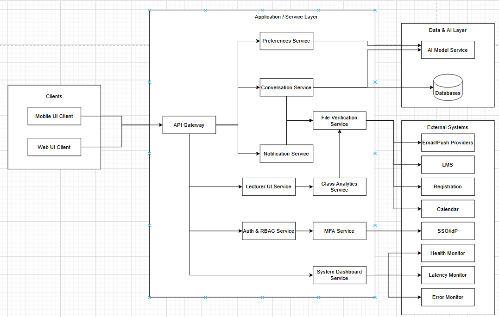

Iteration goal: Refine the system design to ensure QA2, QA5, QA6, and QA7 are satisfied, because these quality attributes have not yet been completely addressed by the design.

---

Major components of the architecture:
| Element | Rationale | Related Quality Attributes |
| --- | --- | --- |
| File integrity verification | To satisfy QA5, a component that verifies file integrity of packets sent between all connected systems to ensure 100% data integrity must be implemented in the system. | QA5 |
| Live monitoring dashboard | Allow system maintainers to monitor the general health of the system, notifying system maintainers when failures may occur. | QA7 |
| Multi-factor authentication | To protect the system from potential brute force login attacks, the component must allow users to set up multi-factor authentication through their phone using a one-time password. | QA6 |
| Lecturer UI service | This component allows lecturers, once authorized, to post course annoucements using text or voice commands. | QA2 |
| Class analytics service | Summarizes class analytics received from the LMS, once the data's integrity has been verified. Works with the lecturer UI service to display a lecturer' class analytics. | QA2 |
---

Choice of reference architecture:
| Design Decision | Rationale |
| --- | --- |
| Extend current Web Application reference architecture with new components. | Keep the reference architecture the same but add five new components to support QA-2, QA-5, QA-6, and QA-7, ensuring they are modular so they can be easily modified if needed. |

---

Instantiate elements:
| Design Decision | Rationale |
| --- | --- |
| File integrity verification service | Supports QA5 by verifying the integrity of packets sent between systems and ensuring 100% data integrity. |
| Live health, latency, and error dashboards | Supports QA7 by allowing maintainers to monitor the general health of the system at any given time. |
| Multi-factor authentication | Supports QA6 by preventing malicious actors from brute forcing their way into a user's account. |
| Lecturer UI service | Supports QA2 by allowing authorized lecturers to post course annoucements to their respective classes. |
| Class analytics service | Supports QA2 by summarizing class data taken from the LMS and allowing lecturers to view their classes' analytics. |

---

Diagram:

---

Analysis of Design:
| Not Addressed | Partially Addressed | Completely Addressed | Rationale |
| --- | --- | --- | --- |
|  |  | UC3, UC4 | UC3 and UC4 are satisfied by the lecturer UI and class analytics services, allowing lecturers to post annoucements and view analytics. |
|  |  | QA5, QA6, QA7 | Components to enchance interoperability, security, and maintainability have been implemented in the design. |
|  |  | CON3, CON5 | The new components are connected to the API gateway and the MFA adheres to security regulations |
|  |  | CRN1, CRN5, CRN6 | MFA addresses how users will authenticate (CRN1), analytics are only exposed to the lecturer of said class (CRN5), and with the lecturer UI service, lecturers are able to publish annoucements for their classes (CRN6). |
